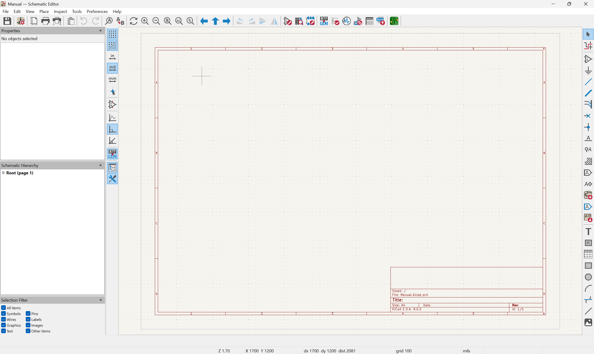

# Editor de Esquemático

El **Schematic Editor** (Editor de Esquemático) de KiCad es la herramienta donde se dibuja el diagrama eléctrico de un circuito, definiendo qué componentes existen y cómo están conectados entre sí.

El esquemático es el punto de partida de cualquier diseño PCB. Sin un esquemático correcto, no es posible generar un PCB confiable.

---

## Acceder al Schematic Editor

Desde el **Project Manager**:

- Haz clic en el botón **Schematic Editor**, o
- Haz doble clic en el archivo `.kicad_sch` del panel de proyecto.

---

## Interfaz principal



*Figura: Interfaz Principal del Editor de Esquemático de KiCad*


---

## Flujo de trabajo básico

```
[1. Agregar símbolos] → [2. Conectar con cables] → [3. Agregar etiquetas]
        ↓
[4. Asignar footprints] → [5. Ejecutar ERC] → [6. Actualizar PCB]
```

1. **Agregar símbolos** de componentes desde la librería.
2. **Conectar** los pines con cables, buses y etiquetas de red.
3. **Etiquetar** las redes importantes (VCC, GND, señales).
4. **Asignar footprints** a cada símbolo (vincula el componente físico).
5. **Ejecutar ERC** (Electrical Rules Check) para detectar errores.
6. **Actualizar el PCB** con los datos del esquemático (`Update PCB from Schematic`).

---

## Atajos de teclado esenciales

| Atajo | Acción |
|-------|--------|
| `A` | Agregar símbolo (componente) |
| `W` | Dibujar cable |
| `P` | Colocar power symbol (VCC, GND) |
| `L` | Agregar etiqueta de red (net label) |
| `E` | Editar propiedades del objeto seleccionado |
| `R` | Rotar elemento seleccionado |
| `G` | Arrastrar cable/componente manteniendo conexiones |
| `Del` | Eliminar objeto seleccionado |
| `Ctrl+Z` | Deshacer |
| `Ctrl+S` | Guardar |
| `Ctrl+D` | Duplicar elemento |
| `F5` | Ejecutar ERC |

---

Continuar en las siguientes secciones:

- [Componentes y Símbolos](Compomentes.md)
- [Agregar Componentes](AgregarCompomentes.md)
- [Conexiones (Wiring)](wiring.md)
