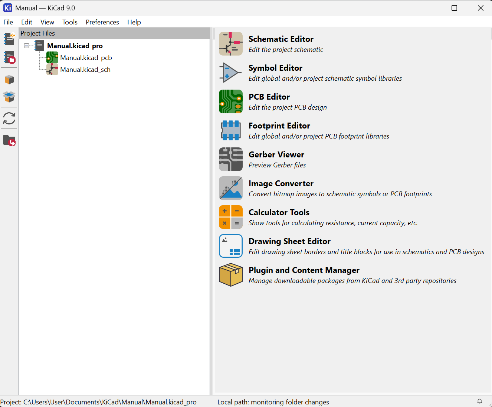

# Instalación de KiCad

Esta sección describe cómo descargar e instalar KiCad en un equipo con **Windows**.

<!--- ---


## Requisitos del sistema

| Requisito | Mínimo | Recomendado |
|-----------|--------|-------------|
| Sistema operativo | Windows 10 (64-bit) | Windows 10/11 (64-bit) |
| Procesador | Intel/AMD x64 | Intel Core i5 o superior |
| RAM | 4 GB | 8 GB o más |
| Espacio en disco | 5 GB | 10 GB o más |
| Pantalla | 1280 × 800 | 1920 × 1080 o superior |
| Tarjeta gráfica | Compatible con OpenGL 2.0 | OpenGL 3.0 o superior |

--- -->

## Descarga

1. Ingresa al sitio oficial: [https://www.kicad.org/download/](https://www.kicad.org/download/)
2. Selecciona **Windows**.
3. Descarga el instalador de la versión estable más reciente (`.exe`).

!!! tip "Versión recomendada"
    En JW Control trabajamos con **KiCad 9.0**. Asegúrate de descargar esta versión para compatibilidad con los proyectos del equipo.

---

## Instalación paso a paso

### 1. Ejecutar el instalador

Haz doble clic en el archivo `.exe` descargado. Si Windows Defender o el Control de Cuentas de Usuario (UAC) lo solicita, confirma con **"Sí"**.

### 2. Pantalla de bienvenida

Haz clic en **Next** para continuar.

### 3. Licencia

Acepta los términos de la licencia GPLv3 y haz clic en **Next**.

### 4. Componentes a instalar

Se recomienda dejar la selección por defecto. Para un uso estándar en JW Control, asegúrate de incluir:

- [x] KiCad Application
- [x] Schematic Libraries
- [x] PCB Footprint Libraries
- [x] 3D Models (opcional, ocupa ~3 GB)
- [x] Documentation

!!! warning "Espacio en disco"
    Las librerías 3D son opcionales. Si el espacio es limitado, puedes omitirlas y agregarlas después.

### 5. Directorio de instalación

Deja la ruta predeterminada o cámbiala si lo prefieres:
```
C:\Program Files\KiCad\9.0\
```

### 6. Instalación

Haz clic en **Install** y espera a que se complete el proceso (puede tardar varios minutos).

### 7. Finalizar

Haz clic en **Finish**. KiCad aparecerá en el menú de inicio de Windows.

---

## Primera ejecución

Al abrir KiCad por primera vez, verás el **Project Manager**:


*Figura: Interfaz del Project Manager de KiCad*

- **Panel izquierdo:** árbol de archivos del proyecto (`.kicad_pro`, `.kicad_sch`, `.kicad_pcb`).
- **Panel derecho:** accesos directos a las herramientas: Schematic Editor, PCB Editor, Footprint Editor, etc.


### Crear un nuevo proyecto

1. Ve a `File → New Project...` (`Ctrl+N`).
2. Elige una carpeta y asigna un nombre al proyecto.
3. KiCad generará automáticamente los archivos base del proyecto.

!!! note "Estructura de archivos"
    Cada proyecto de KiCad genera al menos tres archivos principales:

    | Archivo | Descripción |
    |---------|-------------|
    | `proyecto.kicad_pro` | Archivo de configuración del proyecto |
    | `proyecto.kicad_sch` | Esquemático |
    | `proyecto.kicad_pcb` | Diseño PCB |

---

## Configuración inicial recomendada (JW Control)

Antes de comenzar a trabajar, realiza las siguientes configuraciones:

### Idioma de la interfaz

`Preferences → Preferences → Common → Language → Español` (opcional, muchos usuarios prefieren el inglés por la documentación online).

### Librerías del proyecto

Para proyectos compartidos en JW Control, usa las librerías estándar de KiCad más las librerías internas del equipo cuando estén disponibles.

`Preferences → Manage Symbol Libraries` — Verifica que las librerías estén cargadas correctamente.

### Guardado automático

`Preferences → Preferences → Common → Auto save interval` — Se recomienda establecerlo en **5 minutos**.

---

## Atajos de teclado útiles en el Project Manager

| Atajo | Acción |
|-------|--------|
| `Ctrl+N` | Nuevo proyecto |
| `Ctrl+O` | Abrir proyecto |
| `Ctrl+Shift+S` | Guardar como |
| `Ctrl+Q` | Cerrar KiCad |
